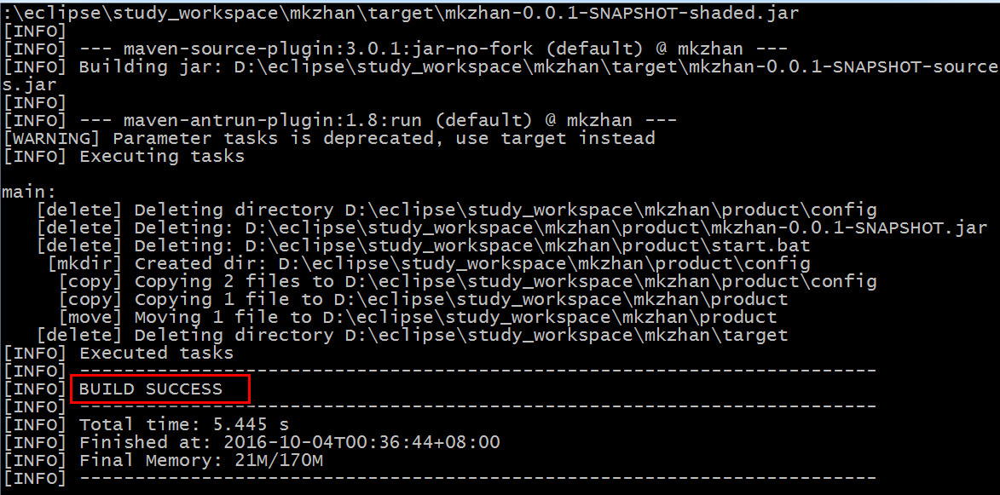
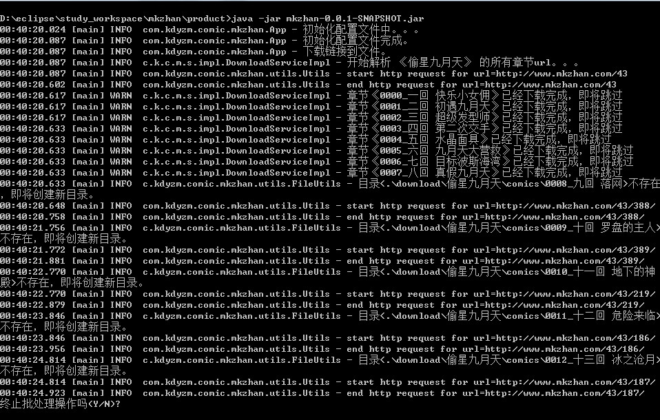

# 漫客栈漫画下载程序
----
## 一、配置
/config/config.js文件是程序的配置文件
* cookie配置了登录相关的访问权限
* url配置了该网站的域名
* defaultBaseDownloadUrlPrefix配置了下载的默认服务器域名
* baseDownloadFileDir配置了下载到本地的默认文件夹
* downloadOptions配置了默认下载文件夹下的两个子目录，分别存放下载的文件和下载文件对应的url文件
* webSites配置了要下载的漫画列表
``` json
{
	"url":"http://www.mkzhan.com",
	"defaultBaseDownloadUrlPrefix":"http://img1.comic.zymk.cn/comic",
	"baseDownloadFileDir":"./download",
	"downloadOptions":{
		"urlsDirName":"urls",
		"picsDirName":"comics"
	},
	"requestConfigInfo":{
		"cookie":""
	},
	"webSites":[
		{
			"baseUrlDir":"./urls",
			"url":"http://www.mkzhan.com/43",
			"name":"偷星九月天",
			"baseDownloadUrlPrefix":""
		},
		{
			"baseUrlDir":"./urls",
			"url":"http://www.mkzhan.com/766",
			"name":"狐剑传",
			"baseDownloadUrlPrefix":""
		},
		{
			"baseUrlDir":"./urls",
			"url":"http://www.mkzhan.com/64593",
			"name":"暴走邻家",
			"baseDownloadUrlPrefix":""
		},
		{
			"baseUrlDir":"./urls",
			"url":"http://www.mkzhan.com/1678",
			"name":"哪吒传",
			"baseDownloadUrlPrefix":""
		},
		{
			"baseUrlDir":"./urls",
			"url":"http://www.mkzhan.com/168536",
			"name":"勇者是女孩",
			"baseDownloadUrlPrefix":""
		},
		{
			"baseUrlDir":"./urls",
			"url":"http://www.mkzhan.com/206800",
			"name":"都市喵奇谭",
			"baseDownloadUrlPrefix":""
		},
		{
			"baseUrlDir":"./urls",
			"url":"http://www.mkzhan.com/51168",
			"name":"九九八十一",
			"baseDownloadUrlPrefix":""
		},
		{
			"baseUrlDir":"./urls",
			"url":"http://www.mkzhan.com/171213",
			"name":"第七魔女",
			"baseDownloadUrlPrefix":""
		},
		{
			"baseUrlDir":"./urls",
			"url":"http://www.mkzhan.com/2535",
			"name":"萝莉杀手",
			"baseDownloadUrlPrefix":""
		},
		{
			"baseUrlDir":"./urls",
			"url":"http://www.mkzhan.com/207217",
			"name":"我的男神是水果",
			"baseDownloadUrlPrefix":""
		},
		{
			"baseUrlDir":"./urls",
			"url":"http://www.mkzhan.com/1782",
			"name":"夜幕西饼屋",
			"baseDownloadUrlPrefix":""
		},
		{
			"baseUrlDir":"./urls",
			"url":"http://www.mkzhan.com/27270",
			"name":"天行轶事",
			"baseDownloadUrlPrefix":""
		},
		{
			"baseUrlDir":"./urls",
			"url":"http://www.mkzhan.com/112209",
			"name":"薄荷之夏",
			"baseDownloadUrlPrefix":""
		},
		{
			"baseUrlDir":"./urls",
			"url":"http://www.mkzhan.com/204074",
			"name":"魔王大人天使臣",
			"baseDownloadUrlPrefix":""
		},
		{
			"baseUrlDir":"./urls",
			"url":"http://www.mkzhan.com/103761",
			"name":"核力突破Level Up",
			"baseDownloadUrlPrefix":""
		}
	]
}
```

## 二、启动程序
使用***```mvn clean package```***命令打包可执行jar，使用***```java -jar mkzhan-0.0.1-SNAPSHOT.jar```***命令运行程序

## 三、示例

###  1.maven打包

### 2.运行程序
找到product文件夹，双击start.bat文件运行程序，运行需要java8环境。

### 3.查看结果
product文件夹下的download文件夹下存放着所有下载的结果。
## 四、注意事项
漫客栈收费漫画特别多，只有非收费漫画才能下载，趁着国庆期间限免可以使用该程序把该死的收费漫画都下载下来到本地看。。